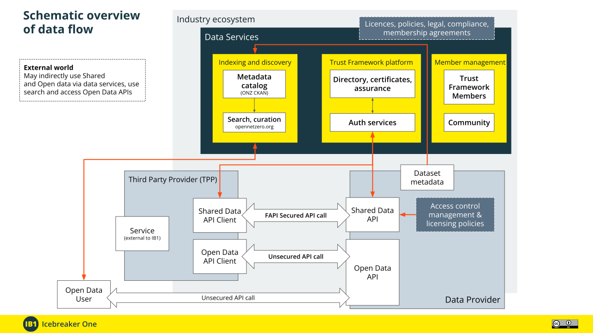

# Trust Framework Documentation

The technical Specifications for [IB1](https://ib1.org) (IB1) [Trust Framework](https://ib1.org/trust-frameworks/) are published at [specification.trust.ib1.org](https://specification.trust.ib1.org). These are designed as a modular set of small, focused specifications. Trust Frameworks and Schemes select the Specifications that define their architecture, and may also introduce their own where appropriate. This site provides an overview of the available specifications, and describes how they fit together.

*Note: These documents use US English. To align with W3C and other prevalent standards, IB1 uses US English in its technical specifications and technical documentation.*

## Registry

[Registry](https://specification.trust.ib1.org/registry/1.0/)
: Defines a machine-readable RDF Registry for describing Trust Frameworks, Schemes, standards, roles, agreements, policies, and other entities.

[Registry Versioning](https://specification.trust.ib1.org/registry-versioning/1.0/)
: Provides a method for versioning RDF resources within the Registry, maintaining immutability while allowing changes via linked versions and Registry Change records.

[Registry Process Resources](https://specification.trust.ib1.org/registry-process-resources/1.0/)
: Specifies how formally defined data processing activities are described using Registry resources with stable URLs.

## Identity, Certificates & Security

[Baseline TLS Configuration](https://specification.trust.ib1.org/baseline-tls-configuration/1.0/)
: Establishes mandatory TLS settings and cryptographic profiles for secure communication within the Trust Framework.

[Member Identity Digital Certificates](https://specification.trust.ib1.org/member-identity-digital-certificates/1.0/)
: Describes digital certificates issued to Members for authentication, enabling secure decentralised identification within the Trust Framework.

[Directory Issued Server TLS Certificates](https://specification.trust.ib1.org/directory-issued-server-tls-certificates/1.0/)
: Defines short-lived TLS server certificates issued by the Directory.

[Public CA Issued Server TLS Certificates with Directory Allowlist](https://specification.trust.ib1.org/public-ca-issued-server-tls-certificates-with-directory-allowlist/1.0/)
: Specifies requirements for public CA-issued TLS certificates and how the Directory maintains an allowlist of permitted DNS names for Member servers.

## Access Control & Permission

[Role-based Access Control](https://specification.trust.ib1.org/role-based-access-control/1.0/)
: Access to data sources is governed by assigned roles and licenses, managed through Data Catalog Entries specifying who can access or publish data.

[Message Delivery to Applications](https://specification.trust.ib1.org/message-delivery-to-applications/1.0/)
: Specifies how Applications exchange JSON messages outside of data transfers, with MTLS authentication and delivery endpoints defined in the Directory.

[OAuth with Member Identity Certificates](https://specification.trust.ib1.org/oauth-with-member-identity-certificates/1.0/)
: An OAuth Profile which requires mutual TLS (MTLS) using Member identity from Directory issued certificates.

[Permission Records](https://specification.trust.ib1.org/permission-records/1.0/)
: Defines how OAuth Issuers provide records containing details of permissions granted by end users, including evidence of consent.

[Withdrawal of Permission](https://specification.trust.ib1.org/withdrawal-of-permission/1.0/)
: Specifies processes for users to withdraw permission, how Members revoke permissions, and cascading revocation of linked permissions.

## Data Catalog & Licenses

[Data Catalog Records](https://specification.trust.ib1.org/data-catalog-records/1.0/)
: Specifies how metadata describing datasets and APIs is structured using DCAT, enabling discovery, access, and licensing information.

[Data Catalog Publishing](https://specification.trust.ib1.org/data-catalog-publishing/1.0/)
: Methods for publishing dataset and API metadata to the Directory, and how records are validated.

[Machine-Readable Data Licenses](https://specification.trust.ib1.org/machine-readable-data-licenses/1.0/)
: Defines how data licenses are published in the Registry as machine-readable RDF resources.

## Open Data

[Open Data Publication](https://specification.trust.ib1.org/open-data/1.0/)
: Defines how datasets are published as Open Data within a Trust Framework.

[Assured Open Data Publication](https://specification.trust.ib1.org/assured-open-data/1.0/)
: Builds on Open Data Publication by introducing dataset assurance levels and strict choice of licenses.

## Provenance & Assurance

[Provenance Records](https://specification.trust.ib1.org/provenance-records/1.0/)
: Captures the origin, processing, transfers, licenses, and permissions associated with data within the Trust Framework.

[Generic Dataset Assurance Levels](https://specification.trust.ib1.org/generic-dataset-assurance-levels/1.0/)
: Establishes standardized levels of dataset assurance, indicating the quality, completeness, and governance applied to published datasets.

[Generic Organizational Assurance Levels](https://specification.trust.ib1.org/generic-organizational-assurance-levels/1.0/)
: Specifies levels of organizational assurance, reflecting the verified trustworthiness and compliance posture of Trust Framework participants.

[Generic Sensitivity Classes](https://specification.trust.ib1.org/generic-sensitivity-classes/1.0/)
: Defines standard sensitivity classes (e.g., Open Data, Shared, Personal) with corresponding access, security, and consent requirements.
